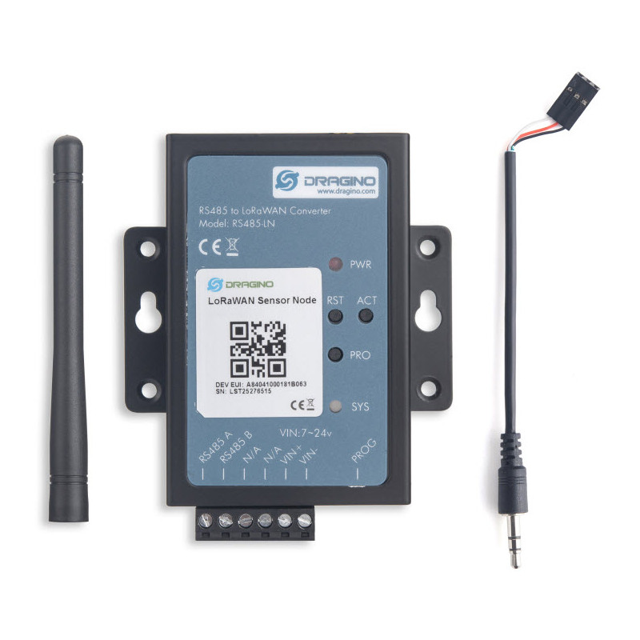

## `Decode-Adeunis-Modbus-sensor-values`
 Here, We are sending adeunis modbus sensor values to ChirpStack NS and using JS code for decode the encryption values. 

## `HIGHLIGHTS`

- RS485/RS232 compatible

- Supervision of up to 20 slaves

- Several periodic frames with different frequencies

- Indicator lights for installation assistance

- Control and supply of power to the sensor

- Local and remote configuration

- Compatible with KARE services

- Available in LoRaWAN US902-928 and AS 923 versions

For more information, [Adeunis](https://www.adeunis.com/en/produit/modbus-interface-for-modbus-slaves/)

## `DRAGINO RS485-LN RS485  MODBUS TO LORAWAN CONVERTER EU868`

- The Dragino RS485-LN is a RS485 to LoRaWAN Converter. 
- It converts the RS485 devices into LoRaWAN wireless network which simplify the IoT installation and reduce the installation/maintaining cost. 
- RS485-LN allows the user to monitor and control RS485 devices at extremely long ranges.

## `Pulse: impulse interface`

## `HIGHLIGHTS`

- Up to 2 connectable meters
- Detection of tampers and leaks
- Meter flow rate monitoring
- Local and remote configurable of the IoT sensor
- Data logging for optimal autonomy
- Redundancy for better service continuity
- Timestamp (LoRaWAN®)
- Network test at startup (LoRaWAN®)
- IP68
- This IoT sensor is available:
- in ATEX version
- in 6-wire version
- with binder connector (ATEX version)
- LoRaWAN US902-928 / AS 923 et Sigfox RC4 versions
- Compatible with KARE+ services

For more information, [Adeunis](https://www.adeunis.com/en/produit/pulse-impulse-interface/)

🚩 `Connect with me on social`
- `LinkedIn:` [LinkedIn](https://www.linkedin.com/in/ariful-islam-arif-2987b51a3/)
- `Twitter:` [Twitter](https://twitter.com/arifulislam301)
- `Instagram:` [Instagram](https://www.instagram.com/ariful_mr_islam/)

🔔 `Subscribe to my YouTube channel:` [YouTube](https://www.youtube.com/channel/UCED68cm6nHaAlAk0h9I3yAQ)
