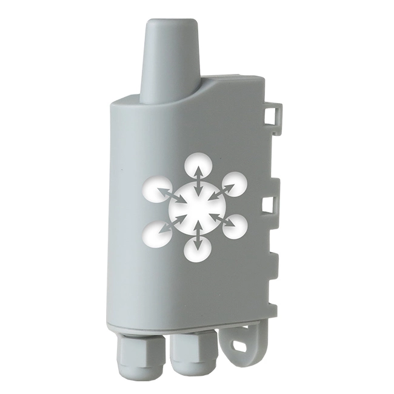

# Decode-Adeunis-Modbus-sensor-values
 Here, We are sending adeunis modbus sensor values to ChirpStack NS and using JS code for decode the encryption values. 

## HIGHLIGHTS

- RS485/RS232 compatible

- Supervision of up to 20 slaves

- Several periodic frames with different frequencies

- Indicator lights for installation assistance

- Control and supply of power to the sensor

- Local and remote configuration

- Compatible with KARE services

- Available in LoRaWAN US902-928 and AS 923 versions

For more information, [Adeunis](https://www.adeunis.com/en/produit/modbus-interface-for-modbus-slaves/)

## DRAGINO RS485-LN RS485  MODBUS TO LORAWAN CONVERTER EU868

- The Dragino RS485-LN is a RS485 to LoRaWAN Converter. 
- It converts the RS485 devices into LoRaWAN wireless network which simplify the IoT installation and reduce the installation/maintaining cost. 
- RS485-LN allows the user to monitor and control RS485 devices at extremely long ranges.

🚩 Connect with me on social
- LinkedIn: [LinkedIn](https://www.linkedin.com/in/ariful-islam-arif-2987b51a3/)
- Twitter: [Twitter](https://twitter.com/arifulislam301)
- Instagram: [Instagram](https://www.instagram.com/ariful_mr_islam/)

🔔 Subscribe to my YouTube channel: [YouTube](https://www.youtube.com/channel/UCED68cm6nHaAlAk0h9I3yAQ)
